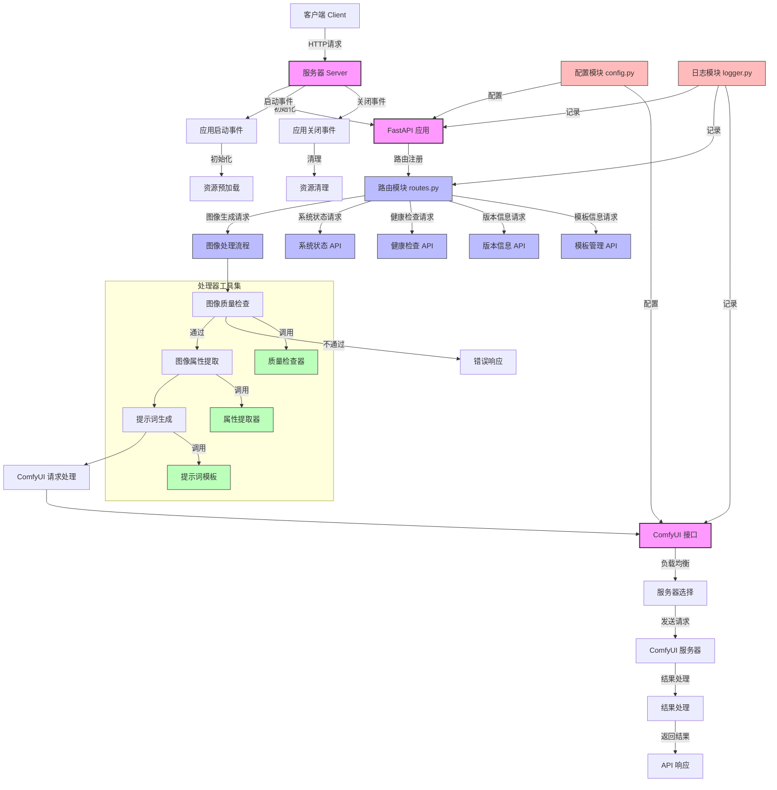

# ComfyBridge 框架流程图

```mermaid
graph TD
    %% 主要组件
    Client[客户端 Client] --> |HTTP请求| Server[服务器 Server]
    Server --> |初始化| App[FastAPI 应用]
    App --> |路由注册| Routes[路由模块 routes.py]
    
    %% 核心处理流程
    Routes --> |图像生成请求| ImageProcess[图像处理流程]
    Routes --> |系统状态请求| SystemStatus[系统状态 API]
    Routes --> |健康检查请求| HealthCheck[健康检查 API]
    Routes --> |版本信息请求| VersionInfo[版本信息 API]
    Routes --> |模板信息请求| Templates[模板管理 API]
    
    %% 图像处理流程详细展开
    ImageProcess --> QualityCheck[图像质量检查]
    QualityCheck --> |通过| AttributeExtraction[图像属性提取]
    QualityCheck --> |不通过| ErrorResponse[错误响应]
    AttributeExtraction --> PromptGeneration[提示词生成]
    PromptGeneration --> ComfyRequest[ComfyUI 请求处理]
    
    %% ComfyUI 集成
    ComfyRequest --> ComfyInterface[ComfyUI 接口]
    ComfyInterface --> |负载均衡| ServerSelection[服务器选择]
    ServerSelection --> |发送请求| ComfyServer[ComfyUI 服务器]
    ComfyServer --> |结果处理| ResultProcessing[结果处理]
    ResultProcessing --> |返回结果| Response[API 响应]
    
    %% 工具集成
    subgraph "处理器工具集"
        QualityCheck --> |调用| QualityValidator[质量检查器]
        AttributeExtraction --> |调用| AttributeExtractor[属性提取器]
        PromptGeneration --> |调用| PromptTemplates[提示词模板]
    end
    
    %% 配置和日志
    Config[配置模块 config.py] --> |配置| App
    Config --> |配置| ComfyInterface
    Logger[日志模块 logger.py] --> |记录| App
    Logger --> |记录| Routes
    Logger --> |记录| ComfyInterface
    
    %% 启动和关闭流程
    Server --> |启动事件| StartupEvent[应用启动事件]
    Server --> |关闭事件| ShutdownEvent[应用关闭事件]
    StartupEvent --> |初始化| ResourceLoading[资源预加载]
    ShutdownEvent --> |清理| ResourceCleanup[资源清理]
    
    %% 样式设置
    classDef core fill:#f9f,stroke:#333,stroke-width:2px;
    classDef api fill:#bbf,stroke:#333,stroke-width:1px;
    classDef tool fill:#bfb,stroke:#333,stroke-width:1px;
    classDef config fill:#fbb,stroke:#333,stroke-width:1px;
    
    class Server,App,ComfyInterface core;
    class Routes,ImageProcess,SystemStatus,HealthCheck,VersionInfo,Templates api;
    class QualityValidator,AttributeExtractor,PromptTemplates tool;
    class Config,Logger config;
```
